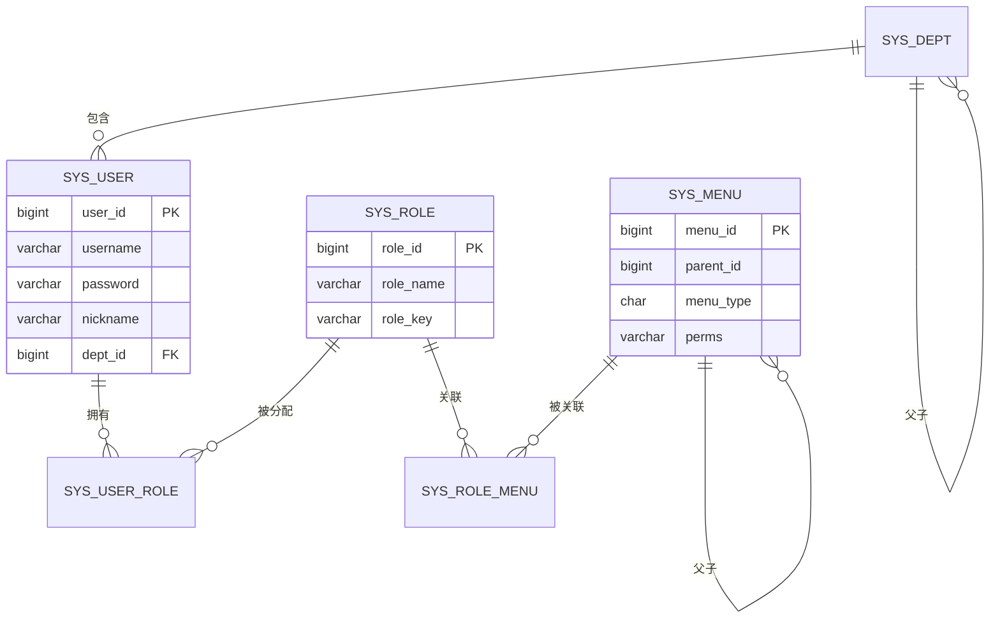

# 新芽 Sprout Admin — 数据库设计

## 1. E-R 关系图

## 2. 核心表说明

### 2.1 用户表 `sys_user`

| 字段 | 类型 | 说明 |
|------|------|------|
| user_id | bigint | 主键，自增 |
| username | varchar(30) | 用户名，唯一 |
| password | varchar(100) | BCrypt 加密存储 |
| nickname | varchar(30) | 昵称 |
| dept_id | bigint | 所属部门 |
| status | char(1) | 0正常 1停用 |
| login_ip / login_date | - | 最后登录信息 |

> 公共字段（create_by / create_time / update_by / update_time / remark / deleted）由 `BaseEntity` 统一维护，各业务表均包含。

### 2.2 角色表 `sys_role`

`role_key` 为权限标识（`admin`、`common`），是判断超级管理员的依据。

### 2.3 菜单表 `sys_menu`

| 字段 | 说明 |
|------|------|
| menu_type | M目录 / C菜单 / F按钮 |
| path / component | 前端路由地址 / 组件路径 |
| perms | 权限标识，如 `system:user:list` |
| parent_id | 父菜单，构建树 |

### 2.4 关联表

- `sys_user_role(user_id, role_id)`：用户-角色，联合主键
- `sys_role_menu(role_id, menu_id)`：角色-菜单，联合主键

### 2.5 日志表

- `sys_login_log`：登录日志（用户名、IP、状态、消息、时间）
- `sys_oper_log`：操作日志（模块、业务类型、方法、参数、结果、耗时）

### 2.6 代码生成表

- `gen_table`：生成配置（表名、类名、包名、模块名、作者）
- `gen_table_column`：字段配置（列名、Java 类型、是否主键/查询/列表、查询方式、显示类型）

## 3. 逻辑删除约定

所有业务表包含 `deleted` 字段（0=存在，1=删除），MyBatis-Plus 通过 `@TableLogic` 自动在查询/删除时拼接 `deleted = 0`，实现软删除。

## 4. 字段自动填充约定

- `create_by` / `create_time`：插入时自动填充
- `update_by` / `update_time`：插入与更新时自动填充
- 填充值来源：当前登录用户名（从 SecurityContext 获取），未登录时兜底为 `system`

## 5. 默认账号

| 账号 | 密码 | 角色 |
|------|------|------|
| admin | admin123 | 超级管理员（admin） |

> 生产环境务必修改密码与 JWT 密钥（`application.yml` 中的 `sprout.jwt.secret`）。
